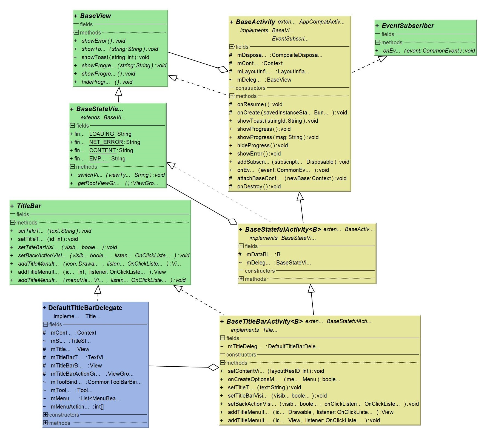

# SimpleLib
[  ](https://bintray.com/cchao1024/maven/simpleLib/_latestVersion)

🔥 **simpleLib** 是笔者开发历程中积累下来的能大幅提升效率的方法和约束整合。旨在 **帮助基于该类库的开发者能够高效的完成 Android 项目搭建和开发**

项目 **持续迭代更新** 中，会继续丰富类库功能。

基于 **Java1.8** 开发，深度依赖以下开源类库

 [data-binding](https://developer.android.com/topic/libraries/data-binding)   [RxJava](https://github.com/ReactiveX/RxJava)  [glide](https://github.com/bumptech/glide)  [okHttp](https://github.com/square/okhttp)  [Gson](https://github.com/google/gson)

# 项目基本结构
```
└── simplelib
    ├── Const.java                     类库所需常量
    ├── LibCore.java                   初始化核心
    ├── core                              
    │   ├── JsonHelper.java            Json转化
    │   ├── ImageLoader.java           图片加载    
    │   ├── Logs.java                  日志管理
    │   ├── PrefHelper.java            SharePreference管理
    │   ├── Router.java                界面跳转路由
    │   ├── RxBus.java                 事件管理
    │   ├── RxHelper.java              RxJava线程调度
    │   └── UiHelper.java              界面工具集合
    ├── http
    │   ├── OkHttpHelper.java          okHttp管理
    │   ├── SslCertHelper.java         ssl信任
    │   ├── cookie                     cookie管理
    │   └── intercaptor                拦截器
    ├── model
    │   ├── DeviceInfo.java            设备信息
    │   └── CommonEvent                事件载体
    ├── ui
    │   ├── BindingAdapters.java       dataBindingAdapter
    │   ├── activity                   activity界面基类
    │   ├── adapter                    基础适配器
    │   ├── fragment                   fragment界面基类
    │   ├── interfaces                 接口约束
    │   └── web                        WebView的封装处理(腾讯x5)
    ├── util
    │   ├── CallBacks.java             基础回调封装
    │   ├── StringHelper.java          字符串工具类集合
    │   ├── ThreadHelper.java          线程调度工具类集合
    │   └── UrlUtil.java               Url工具类集合
    └── view                           自定义view集合
```
# 如何使用
### 1. 引入依赖

```java
// app/build.gradle 处添加依赖
implementation 'com.github.cchao:simpleLib:[last_version]'
```
 **或** clone 类库作为项目的子模块引用
### 2. 初始化类库

```java
public class App extends Application {
    
    @Override
    public void onCreate() {
        super.onCreate();
        
        // 核心 初始化
        LibCore.init(mContext, new LibCore.InfoSupport() {
            // 使用Lib提供的 OkhttpClient 能获取基本的网络交互日志
            public OkHttpClient getOkHttpClient() {
                return OkHttpManager.getOriginClient();
            }

            public LibCore.ILogEvents getLogEvents() {
                return new LibCore.ILogEvents() { /* 自定义日志上报规则 */};
            }

            public LibCore.RouterConfig getRouterConfig() {
                return new LibCore.RouterConfig() { /* 自定义路由拦截规则 */};
            }
        });
        
        // 自定义基础样式
        LibCore.setLibConfig(new LibCore.LibConfig() { /* 自定义界面基础样式 */ });
    }
}
```

# 类库说明

## 核心依赖

基础核心，进行初始化和依赖对象的注入, 由 **InfoSupport** 和 **LibConfig** 提供配置项

* **InfoSupport** 返回基本且必须的参数
  
  * **getOkHttpClient**  提供给上层调用，默认使用 SimpleLib **默认的 OkHttpClient 实例**
  * **getLogEvents**  日志事件回调，可以在这执行日志收集（比如 Bugly 收集）
  * **getRouterConfig**  路由配置，如：某些需要登录权限的页面会调用配置中的跳转代码
* **LibConfig** 配置关于样式上的自定义
  
  - 自定义的配置项，比如加载对话框，标题栏，页面加载图，加载失败图等。非必选的，不配置的话 会返回默认的实现。


> 篇幅有限，更详细的配置范例移步 [详细配置范例](https://github.com/cchao1024/simpleLib/blob/master/document/InitSample.MD) 查看

## 界面基础
**ui**目录提供了 基础的 **BaseActivity** 和 **BaseFragment** 实现，各级界面 Base 类通过接口实现 **约束**，方便子类业务交互调用

- **BaseView** - 简单的界面交互操作，如： `showToast`  `showProgress`
- **BaseStateView** - 界面状态切换（加载、异常、空数据等）
- **TitleBar** - 配合 **LibCore.LibConfig** 提供标题栏操作
- **EventSubscriber** - 事件订阅回调接口




## 网络交互

**RxHelper** 依赖 **Rxjava** 提供了线程切换和结合基础界面接口 **BaseView/BaseStateView** 的交互和状态切换

(执行 **Error consumer** 均会触发 **Logs** 的异常日志收集上报)

```java
// 显示 加载框，开始发起网络请求
showProgress();
addSubscribe(RetrofitHelper.getApis().login(email, password)
    .compose(RxHelper.toMain())
    .subscribe((respBean -> {
        hideProgress();
        // 失败，弹出异常文案
        if (respBean.isCodeFail()) {
            showToast(respBean.getMsg());
            return;
        }
        // 发送事件，登录成功
        RxBus.get().postEvent(Constant.Code.LOG_IN);
    }, RxUtil.getHideProgressError(this));
```


## 其他核心类

- **Logs** 日志类，包括日志输出与日志收集
- **RxBus** 基于 RxJava 的事件总线
- **PrefHelper** 对 SharedPreferences 基本操作
- **RxHelper** 对 RxJava 一些方法调用封装
- **Router** 对 Activity 跳转和传参的封装
- **UiHelper** 界面相关操作的整合
- **JsonHelper** - 对 Json 的操作

> 篇幅有限，更多的类库使用范例移步 [核心类库使用范例](./document/coreSample.MD) 查看


# ChangeLog

## 2019-11-20_v1.1.0 
- 新增 **JsonHelper**（弃用GsonUtil）
- 新增 **DevHelper** 提供应用内的开发者选项（方便调试）
- 修改 **WebViewFragment** 使用 **X5** 内核做网页的解析
        
## 2019-11-25_v1.2.0
- 新增滴滴 DoKit        
                 