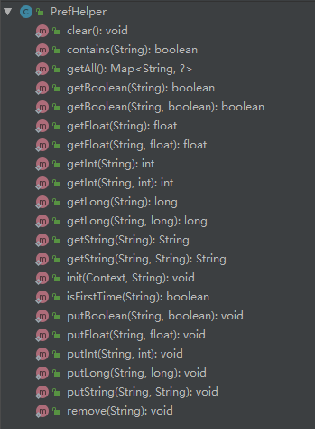

# 核心基础类

- **Logs** 日志类，包括日志输出与日志收集
- **RxBus** 基于 RxJava 的事件总线
- **PrefHelper** 对 SharedPreferences 基本操作
- **RxHelper** 对 RxJava 一些方法调用封装
- **Router** 对 Activity 跳转和传参的封装
- **UiHelper** 界面相关操作的整合
- **JsonHelper** 对 Json 的操作
- **DevHelper** 开发者功能入口
- **AndroidHelper** 系统参数帮助类
## Logs

日志使用的默认的Log实现，其中 logEvent 和 logException 是作为日志事件收集（InfoSupport 需实现异常收集平台的收集代码）使用的，便于异常发生时能够回溯用户的行为。
NOTE: 网络请求默认输出并上报异常到日志收集，具体请查阅http目录下的 **RequestLogInterceptor** 和 **RespExceptionLogInterceptor**

## RxBus 

**RxBus** 基于 **Rxjava** 的事件订阅，可以在任一线程 发送事件，事件可以为通用事件 CommonEvent，加上 **Code** 作为标识，也可以通过特定对象传递大的事件数据。
简单的事件传递 像这样

```java
// 发送事件
RxBus.get().postEvent(Constant.Code.LOG_IN);
// 订阅事件
addSubscribe(RxBus.get().toObservable(event -> {
    switch (event.getCode()) {
        case Constant.Code.LOG_IN:
            showToast("Login");
            break;
        case Constant.Code.LOG_OUT:
            showToast("LogOut");
            break;
        case Constant.Code.SIGN_UP:
            showToast("SignUp");
            break;
    }
}));
```

## RxHelper

**RxHelper** 提供了线程切换和结合基础界面接口 BaseView/BaseStateView 的交互和状态切换

- **toMain** 线程从 io 到 main 的切换
- **getSwitchErrorConsumer** 传入 BaseStateView 切换视图为网络异常状态
- **getHideProgressConsumer** 隐藏 加载框
- **getErrorTextConsumer** 弹出网络异常文案

## UiHelper

提供笔者认为能简化代码，提高效率的工具方法，


## Router
路由是连接各个页面的纽带，强烈建议读者使用 Router 类实现 Activity 的跳转，配合 LibCore#RouterConfig 的配置，能够方便的实现 Java 中的面向切面编程且不引入新的类库。

```java
// 要求已经绑定卡的用户才能进入商品支付页
Router.turnTo(mContext, PayProductActivity.class)
    .putExtra(Constants.Extra.JSON, JsonHelper.toJson(mHomeRecItem))
    .checkLogin(true)
    .checkStatus(Constants.Rout.bind_card, true)
    .start();

// startActivityForResult
Router.turnTo(context, LoginActivity.class)
    .startForResult(ConstantCodeUtils.START_LOGIN);
  //.startInNewTask  在新的界面栈打开
``` 

## PrefHelper
对 SharePreference 的封装操作
> 该类的提交均为 apply（异步提交）不是 commit（同步提交），需要考虑业务的时效性



## JsonHelper
对 json 格式的 序列号和反序列化


## DevHelper

显示 **开发者功能选项** 对话框，传入正确的暗号后 能弹出 功能选项，比如 主api生产环境和测试环境的切换。
```java
public static void showDevOptionDialog(Context context, String devSignal, List<DevOptionItem> mOptions) {
    /*
     * 无暗号，或暗号已经验证成功已是开发者
     */
    if (isDev() || StringHelper.isEmpty(devSignal)) {
        showDevOptionDialog(context, mOptions);
        return;
    }

    EditText editText = new EditText(context);
    new AlertDialog.Builder(context)
        .setTitle("输入开发者暗号")
        .setView(editText)
        .setPositiveButton(R.string.confirm, (dialog, which) -> {
            if (!editText.getText().toString().equals(devSignal)) {
                return;
            }

            PrefHelper.putBoolean(Const.Pref.Dev_Mode, true);
            showDevOptionDialog(context, mOptions);
        }).show();
}
```
